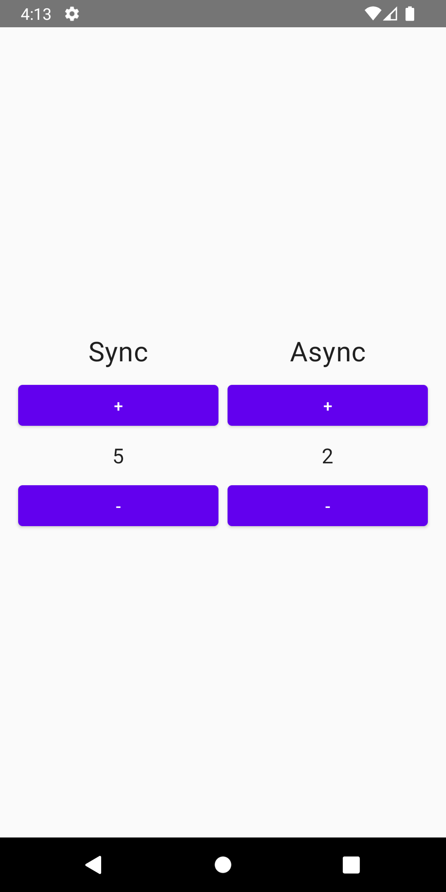

[](https://opensource.org/licenses/Apache-2.0)


# Overview
## What is The Elm Architecture
The Elm Architecture ([Elm Architecture](https://guide.elm-lang.org/architecture/)) is a popular software architecture pattern used in the 
Elm programming language. It provides a structure for development based on functional programming and a unidirectional data flow.


The Elm Architecture consists of three main components:
- `Model` This is the application state that contains all the data needed for its functioning. The model is immutable and is updated only 
through messages (`Msg`).
- `Update` This is a function that takes the current model and a message and returns a new model. It is responsible for handling messages 
and updating the application state.
- `View` This is a function that takes the current model and returns the user interface. The view displays data from the model and reacts 
to user actions by generating new messages.

The Elm Architecture provides a clear separation between the application logic and its presentation, making the code more understandable, 
modular, and easily testable. It also ensures error resilience and prevents many common problems associated with mutable state and side 
effects.


## What is Keemun
Keemun is a multiplatform Kotlin framework that provides a way to write shared code using The Elm Architecture pattern.


# Setup
## Gradle
A number of modules have been published on Maven Central:
- `core` Basic interfaces and functional capabilities of the architecture (multiplatform)
- `decompose` Integration via Decompose (multiplatform)
- `swiftui` Integration for SwiftUI (only Swift)

Add the necessary modules to the build.gradle file of your module:

```gradle
implementation "io.github.pavelannin:keemun-<module-name>:<version>"
```


# Componets
## State
`State` is a class that describes the state of your application/feature/screen/view/etc. at a specific moment in time.

```kotlin
data class State(
    val syncCount: Int,
    val asyncCount: Int,
    val isAsyncRunning: Boolean,
)
```

## Msg
Any `Msg` represents an intention to change the state. `Msg` is sent from the user interface/business logic.

```kotlin
/** Common type of messages. */
sealed interface Msg

/** External messages (from the user interface). */
sealed class ExternalMsg : Msg {

    /** Increment the sync counter. */
    data object IncrementSync : ExternalMsg()

    /** Increment the async counter. */
    data object IncrementAsync : ExternalMsg()
}

/** Internal messages (from EffectHandler). */
sealed class InternalMsg : Msg {

    /** Result of an async operation. */
    data class CompletedAsyncOperation(val value: Int) : InternalMsg()
}
```


## Effect
Any `Effect` represents an intention to invoke part of your business logic. `Effect` is sent from the update depending on the received 
message.

```kotlin
sealed class Effect {

    /** Increment the counter. */
    data class Increment(val value: Int) : CounterEffect()
}
```

## Update
`Update` is the place for logic. Its method takes `state` and `msg` as arguments and returns a new `state` and a collection of `effects`. 
The idea is to be a pure function that modifies the `state` and sends an side-effect according to the received `message` and the current 
`state`.

```kotlin
val externalUpdate = Update<State, ExternalMsg, Effect> { msg, state ->
    when (msg) {
        ExternalMsg.IncrementSync ->
            state.copy(syncCount = state.syncCount.inc()) to emptySet()

        ExternalMsg.IncrementAsync ->
            if (state.isAsyncRunning) {
                state to emptySet()
            } else {
                state.copy(isAsyncRunning = true) to setOf(Effect.Increment(state.asyncCount))
            }
    }
}

val internalUpdate = Update<State, Msg, Effect> { msg, state ->
    when (msg) {
        is InternalMsg.CompletedAsyncOperation ->
            state.copy(asyncCount = msg.value, isAsyncRunning = false) to emptySet()
    }
}
```

## EffectHandler
`EffectHandler` is the place where business logic is executed. Its method takes `effect` and `dispatch` as arguments. The idea is to be a 
function that sends messages to `dispatch` according to the received effect and performs the operation. `EffectHandler` is a 
suspend function, and each effect is executed in a separate coroutine.

```kotlin
val effectHandler = EffectHandler<Effect, InternalMsg> { effect, dispatch ->
    when (effect) {
        is Effect.Increment -> {
            delay(1_000)
            dispatch(InternalMsg.CompletedAsyncOperation(effect.value.inc()))
        }
    }
}
```

## PreInitEffect
`PreInitEffect` is the place where logic necessary for initializing the `Store` is executed. `PreInitEffect` returns a type that is later 
used for initialization. In most scenarios, there is no need to use `PreInitEffect`.

**NOTE** `EffectHandler` is a suspend function that **blocks** the current thread.

```kotlin
val preInitEffect = PreInitEffect { fetchCachedCounter() }
```

## Init
`Init` is the place for initialization. Its method takes `previousState` (if the state is being persisted) and `deps` (optionally received 
from `PreInitEffect`), and returns the initializing `state` and the initial set of side-effects.

```kotlin
val init = Init<CounterState, CounterEffect, Int> { previous, deps ->
    val state = previous ?: CounterState(
        syncCount = deps,
        asyncCount = deps,
        isAsyncRunning = false,
    )
    state to emptySet()
}
```

## StoreParams
`StoreParams` is a container that holds `PreInitEffect`, `Init`, `Update`, and `EffectHandler` in one place for creating a `Store`. 
`StoreParams` provides several convenient overridden functions for creating it with optional arguments.

```kotlin
val storeParams = StoreParams<State, Msg, Effect, Deps>(
    preEffectInit = { },
    init = { },
    update = { },
    effectHandler = { },
)
```

## Connector
`Connector` is an entity that holds an instance of `Store`.

## FeatureParams
`FeatureParams` is a container that holds `StoreParams`, a function for transforming `State` into `ViewState`, and other parameters 
required for creating a `Connector`. `FeatureParams` provides several convenient overridden functions for creating it with optional 
arguments.

```kotlin
val featureParams = FeatureParams<State, Msg, ViewState, ExternalMsg>(
    storeParams = StoreParams(),
    viewStateTransform = StateTransform<State, ViewState> {},
    externalMessageTransform = { externalMsg -> },
    startedOptions = FeatureStartedOptions.Lazily,
)
```

# Sample project
The sample project is a screen with two counters: synchronous and asynchronous. The synchronous counter is modified in `Update`, 
demonstrating state changes, while the asynchronous counter is modified in `EffectHandler`, simulating asynchronous business logic. 
The example is implemented for Android and iOS with shared business logic in Kotlin Multiplatform.

## Screenshots


